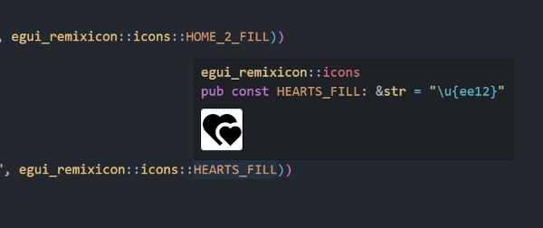

# egui_remixicon

Bundles [Remix Icon](https://remixicon.com/) with boilerplate to use in your egui app.

Got inspired by [egui_phosphor](https://github.com/amPerl/egui-phosphor), code uses the same structure.

## Installation

Add the crate as a dependency in Cargo.toml:

```toml
egui-remixicon = "0.29.1"
```

On startup, update the fonts in your egui context:

```rust
let mut fonts = egui::FontDefinitions::default();
egui_remixicon::add_to_fonts(&mut fonts);

cc.egui_ctx.set_fonts(fonts);
```

### Install without egui dependency

If you would like to use this crate without egui or with an egui version that is out of sync with the latest version of this crate, you can add without default features:

```toml
egui-remixicon = { version="0.29.1", default-features=false }
```

The font file can then be accessed as
``` rust
egui_remixicon::FONT
```

## Usage

Use the constants provided by the crate in your text:

```rust
ui.label(egui::RichText::new(format!("{} Heart", egui_remixicon::icons::HEARTS_FILL)).size(32.0));
```

## Icon comments



## License

egui-remixicon is licensed under [MIT](LICENSE-MIT) OR [Apache-2.0](LICENSE-APACHE). Remix Icon are licensed under [Apache-2.0](https://github.com/Remix-Design/remixicon/blob/master/License).
